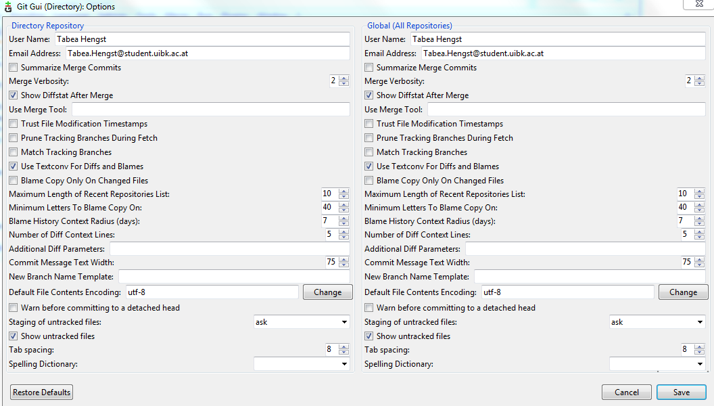

# Erste Übung 

## Mitschrift Arebeitsablauf 

* Gitgui öffnen und einen neuen Ordner anlegen
* öffne Notepad++, um die WORKEFLOW.md Datei zu ertsellen
* Text in Notepad++ eintippen und abspeichern und achte auf leerzeichen oder benutze zur Hilfe der Anweisungen markdown cheat sheet, welche du im Browser suchst
* gehe in Gitgui und durchlaufe die Arbeitsschritte 

1. Rescan
1. Stage Change
1. Sing off
1. Commit
1. Push 

* Extra: Voehereinstellungen: Edit Options-> wir arbeiten im Globel(All Repositories) bei default file Contents Encoding: uft-8 und gebe deinen Namen und email Adresse an

* im gelben Bereich von Gitgui werden dir in grün die neuen Befehle (Bsp. Aufzählungen) angezeigt, welche hinzugefügt wurden und in rot die alte Aufzählung

* Erstelle neuen Repository auf github.com, erstelle neues Projekt und füge Link unter remote und add im Gitgui hinzu 
